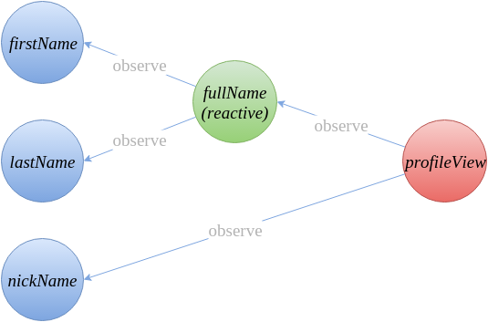
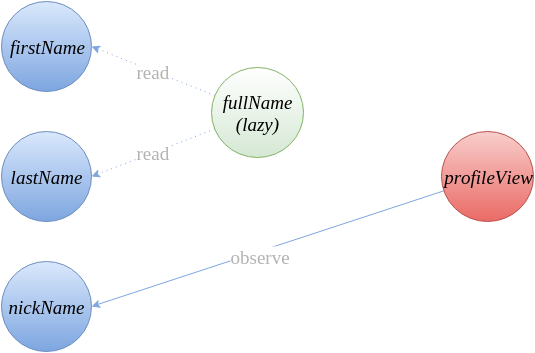
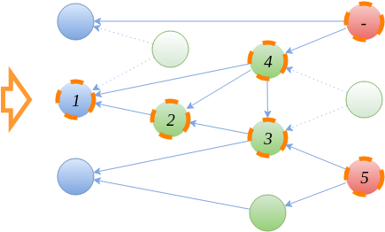

# mobx 工作流
作为app的数据管理部分，mobx和redux的工作模式很接近。都是通过action来改变store；store改变后，响应的组件自动更新。


1. Observable state. mobx会把简单类型 (primitives, arrays, classes, objects, 等.) 包装成响应式的对象。只需一行代码即可完成。

2. Computed values. 根据 Observable state 通过简单的纯函数生成的值。Computed values 可以可观察的（obserable）。Computed values可能是及时求值，也可能是延迟求值；主要是根据是否有观察者（observer）。

3. Reactions. 和 computed value 类似, 主要区别是 Reactions 会生成一个`副作用`(side effect),而不是一个新的值。常见的副作用可能是：通过console输出，或者发送网络请求，或者react 组件更新等。

4. Actions. Actions 是主要修改 state 的源头。是修改 state，而不是响应 state 的修改。常见的 Actions 包含：用户触发的事件，socket 数据变化等。

# mobx 应用示例
先上代码
```js
class Person {
  @observable firstName = "Michel";
  @observable lastName = "Weststrate";
  @observable nickName;
  
  @computed get fullName() {
    return this.firstName + " " + this.lastName;
  }
}

const michel = new Person();

// Reaction: log the profile info whenever it changes
autorun(() => console.log(person.nickName ? person.nickName : person.fullName));

// Example React component that observes state
const profileView = observer(props => {
  if (props.person.nickName)
    return <div>{props.person.nickName}</div>
  else
    return <div>{props.person.fullName}</div>
});

// Action:
setTimeout(() => michel.nickName = "mweststrate", 5000)

React.render(React.createElement(profileView, { person: michel }), document.body);
```

最开始的观察关系如下（蓝色：observable；绿色：computed）：


当nickName有值之后；依赖关系则会变更。


# mobx 的初衷及特点

1. 复杂应用的状态可以使用`图`（graph）来表示。
The application state of complex applications can best be expressed using graphs to achieve referential consistency and stay close to the mental model of a problem domain.

2. 人工订阅方式最终导致会导致遗漏或者多次订阅。
 One should not imperatively act on state changes by using manually defined subscriptions or cursors. This will inevitably lead to bugs as a result of under- or oversubscribing.

3. 使用运行时分析最终使得在数据更新后，最小的依赖（派生，derivations）更新。
Use runtime analysis to determine the smallest possible set of observer → observable relationships. This leads to a computational model where it can be guaranteed that the minimum amount of derivations are run without ever observing a stale value.

4. Any derivation that is not needed to achieve an active side effect can be optimized away completely.

5. mobx 的观察变更是同步的；
6. observer 的实现是基于Object.defineProperty;通过es6的proxy可以更优雅的实现；但是低版本浏览器有兼容问题。

# mobx 核心算法

结合一个示例说明：


1. 发送【脏通知】，标记所有相关数据（橙色虚线）。  
The observable value sends a stale notification to all its observers to indicate that it has become stale. Any affected computed values will recursively pass on the notification to their observers. As a result, a part of the dependency tree will be marked as stale. In the example dependency tree of figure 5, the observers that will become stale when value ‘1’ is changed are marked with an orange, dashed border. These are all the derivations that might be affected by the changing value.

2. 改变源数据（action 中修改的数据），发送【准备通知】。  
After sending the stale notification and storing the new value, a ready notification will be sent. This message also indicates whether the value did actually change.

3. 依赖（相关数据），收到准备通知后，按照依赖关系开始重新计算。(依赖关系用图表示)，这个过程会递归的进行。
As soon as a derivation has received a ready notification for every stale notification received in step 1, it knows that all the observed values are stable and it will start to recompute. Counting the number of ready / stale messages will ensure that, for example, computed value ‘4’ will only re-evaluate after computed value ‘3’ has become stable.

4. 没有收到【准备通知】的说明数据没有变。
If none of the ready messages indicate that a value was changed, the derivation will simply tell its own observers that it is ready again, but without changing its value. Otherwise the computation will recompute and send a ready message to its own observers. This results in the order of execution as displayed in the figure. Note that (for example) the last reaction (marked with ‘-’) will never execute if computed value ‘4’ did re-evaluate but didn’t produce a new value.

参考：

https://mobx.js.org/

https://hackernoon.com/becoming-fully-reactive-an-in-depth-explanation-of-mobservable-55995262a254

https://hackernoon.com/the-fundamental-principles-behind-mobx-7a725f71f3e8