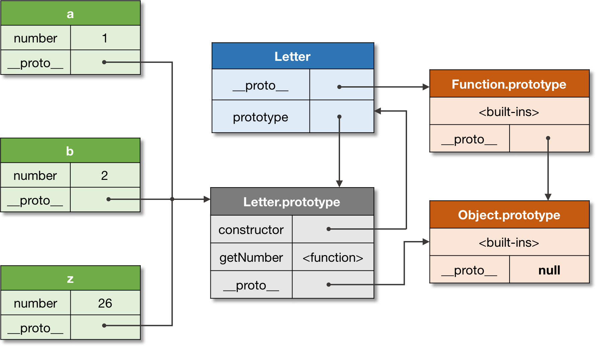
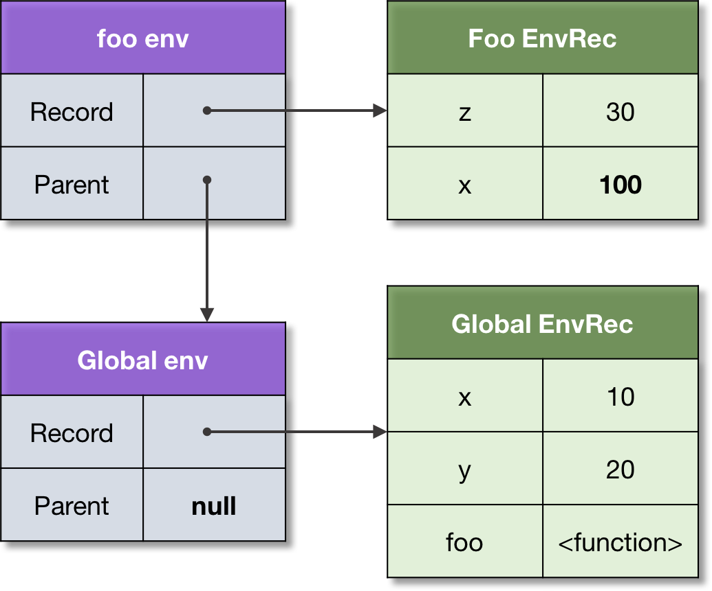
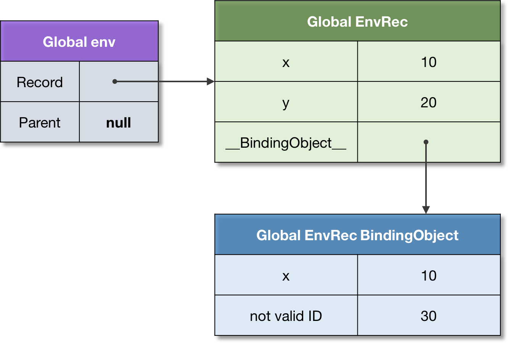

这是其实是一片总结，[JavaScript. The Core: 2nd Edition](http://dmitrysoshnikov.com/ecmascript/javascript-the-core-2nd-edition/)这篇文章至少读了3遍，但是一段时间后脑子了就觉得很模糊。于是总结一下，用于复习。

## 对象
Def. 1: Object: An object is a collection of properties, and has a single prototype object. The prototype may be either an object or the null value.


## Prototype

Def. 2: Prototype: A prototype is a delegation object used to implement prototype-based inheritance.

Def. 3: Prototype chain: A prototype chain is a finite chain of objects used to implement inheritance and shared properties.

代码示例：
```javascript
// Base object.
let point = {
  x: 10,
  y: 20,
};
 
// Inherit from `point` object.
let point3D = {
  z: 30,
  __proto__: point,
};
 
console.log(
  point3D.x, // 10, inherited
  point3D.y, // 20, inherited
  point3D.z  // 30, own
);
```


Def. 4: Delegation: a mechanism used to resolve a property in the inheritance chain. The process happens at runtime, hence is also called dynamic dispatch.

## 类

Def. 5: Class: A class is a formal abstract set which specifies initial state and behavior of its objects.

When several objects share the same initial state and behavior, they form a classification.

静态类 vs 动态类 Note: a “class” is just a theoretical abstraction. Technically it can be implemented with the static dispatch as in Java or C++, or dynamic dispatch (delegation) as in JavaScript, Python, Ruby, etc.

Def. 6: Constructor: A constructor is a function which is used to create instances, and automatically set their prototype.

示例：
```javascript
function Letter(number) {
  this.number = number;
}
 
Letter.prototype.getNumber = function() {
  return this.number;
};
 
let a = new Letter(1);
let b = new Letter(2);
// ...
let z = new Letter(26);
 
console.log(
  a.getNumber(), // 1
  b.getNumber(), // 2
  z.getNumber(), // 26
);
```

补充： 多实使用 instanceof   而不是 constructor

## Execution context

Def. 7: Execution context: An execution context is a specification device that is used to track the runtime evaluation of the code.

There are several types of ECMAScript code:

  + the global code,
  + function code, 
  + eval code, 
  + module code; 

Different code types, and their appropriate objects may affect the structure of an execution context

Def. 8: Execution context stack: An execution context stack is a LIFO structure used to maintain control flow and order of execution.

示例：
```JavaScript
function recursive(flag) {
 
  // Exit condition.
  if (flag === 2) {
    return;
  }
 
  // Call recursively.
  recursive(++flag);
}
 
// Go.
recursive(0);
```


### 特例 
```JavaScript
function *gen() {
  yield 1;
  return 2;
}
 
let g = gen();
 
console.log(
  g.next().value, // 1
  g.next().value, // 2
);
```

The yield statement here returns the value to the caller, and pops the context. On the second next call, the same context is pushed again onto the stack, and is resumed. Such context may outlive the caller which creates it, hence the violation of the LIFO structure.

## Environment

Def. 9: Lexical environment: A lexical environment is a structure used to define association between identifiers appearing in the context with their values. Each environment can have a reference to an optional parent environment.

示例：
```JavaScript
let x = 10;
let y = 20;
 
function foo(z) {
  let x = 100;
  return x + y + z;
}
 
foo(30); // 150
```



Def. 10: Identifier resolution: the process of resolving a variable (binding) in an environment chain. An unresolved binding results to ReferenceError.

Environment records differ by type.

+ object environment records
+ declarative environment records
  - function environment records
  - module environment records

An example of an object environment record  示例
```JavaScript
// Legacy variables using `var`.
var x = 10;
 
// Modern variables using `let`.
let y = 20;
 
// Both are added to the environment record:
console.log(
  x, // 10
  y, // 20
);
 
// But only `x` is added to the "binding object".
// The binding object of the global environment
// is the global object, and equals to `this`:
 
console.log(
  this.x, // 10
  this.y, // undefined!
);
 
// Binding object can store a name which is not
// added to the environment record, since it's
// not a valid identifier:
 
this['not valid ID'] = 30;
 
console.log(
  this['not valid ID'], // 30
);
```

Notice, the binding object exists to cover legacy constructs such as var-declarations, and with-statements, which also provide their object as a binding object. These are historical reason when environments were represented as simple objects. Currently the environments model is much more optimized, however as a result we can’t access binding as properties anymore.

## Closure

Def. 11: First-class function: a function which can participate as a normal data: be stored in a variable, passed as an argument, or returned as a value from another function.

Def. 12: Free variable: a variable which is neither a parameter, nor a local variable of this function.

Def. 13: Static scope (lexical scope): a language implements static scope, if only by looking at the source code one can determine in which environment a binding is resolved.

### downwards funarg problem
```javascript
let x = 10;
 
function foo() {
  console.log(x);
}
 
function bar(funArg) {
  let x = 20;
  funArg(); // 10, not 20!
}
 
// Pass `foo` as an argument to `bar`.
bar(foo);
```

### upwards funarg problem
```javascript
function foo() {
  let x = 10;
   
  // Closure, capturing environment of `foo`.
  function bar() {
    return x;
  }
 
  // Upward funarg.
  return bar;
}
 
let x = 20;
 
// Call to `foo` returns `bar` closure.
let bar = foo();
 
bar(); // 10, not 20!
```
## this

according Def. 16, all identifiers are statically scoped. There is however one value which is dynamically scoped in ECMAScript. It’s the value of `this`.
The major use-case is the class-based OOP.

Def. 15: This: an implicit context object accessible from a code of an execution context — in order to apply the same code for multiple objects.


ref [JavaScript. The Core: 2nd Edition](http://dmitrysoshnikov.com/ecmascript/javascript-the-core-2nd-edition/)