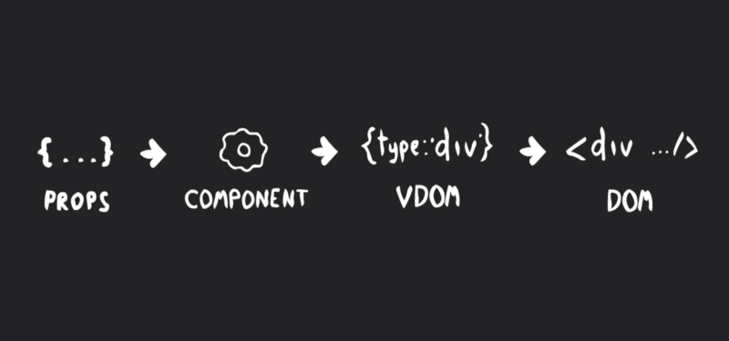

# 自己实现 react

## 概要
实现一个 react，包含 组件 API 和 VDOM(虚拟 DOM) 。主要分为4大部分。
+ **Elements**: 这一节主要内容是 jsx，怎么把jsx转成 vDOM
+ **Rendering**: 这一节将演示怎么把 VDOM  转成真实的 DOM。
+ **Patching**: 这一节我们将演示 key 的重要性，及怎么提高二次渲染的效率。
+ **Components**: 最后一节演示，react 组件的创建，组件的生命周期及渲染的过程。

## 元素

元素(element)是一个轻量的对象，用来表示 DOM。主要由**3**个部分组成，类型(type)，属性(attribute)，子列表(children)。

[code pen example](https://codepen.io/SweetPalma/pen/gzpZNv?editors=0010)

以下是3个元素的示例：
```javascript
{
    "type": "ul",
    "props": {
        "className": "some-list"
    },
    "children": [
        {
            "type": "li",
            "props": {
                "className": "some-list__item"
            },
            "children": [
                "One"
            ]
        },
        {
            "type": "li",
            "props": {
                "className": "some-list__item"
            },
            "children": [
                "Two"
            ]
        }
    ]
}
```

为了简化属性，Facebook 发明了 jsx。jsx 需要被编译。示例如下：

```javascript

//编译前
const list = <ul className="some-list">
    <li className="some-list__item">One</li>
    <li className="some-list__item">Two</li>
</ul>;

//编译后
const list = createElement('ul', {className: 'some-list'},
    createElement('li', {className: 'some-list__item'}, 'One'),
    createElement('li', {className: 'some-list__item'}, 'Two'),
);

// createElement的实现大概如下
const createElement = (type, props, ...children) => ({
    props = props != null ? props : {};
    return {type, props, children};
});

```

## 渲染

渲染(rendering)就是把 VDOM 转成 DOM 的过程。其实就是就是一个算法，遍历 VDOM 树，生成真实的 DOM。

[code pen example](https://codepen.io/SweetPalma/pen/ZoGwWY?editors=0010)

```javascript
const render = (vdom, parent=null) => {
    if (parent) parent.textContent = '';
    const mount = parent ? (el => parent.appendChild(el)) : (el => el);
    if (typeof vdom == 'string' || typeof vdom == 'number') {
        return mount(document.createTextNode(vdom));
    } else if (typeof vdom == 'boolean' || vdom === null) {
        return mount(document.createTextNode(''));
    } else if (typeof vdom == 'object' && typeof vdom.type == 'function') {
        return mount(Component.render(vdom));//这个Component，需要后面的知识？！
    } else if (typeof vdom == 'object' && typeof vdom.type == 'string') {
        const dom = document.createElement(vdom.type);
        for (const child of [].concat(...vdom.children)) // flatten
            dom.appendChild(render(child));
        for (const prop in vdom.props)
            setAttribute(dom, prop, vdom.props[prop]);
        return mount(dom);
    } else {
        throw new Error(`Invalid VDOM: ${vdom}.`);
    }
};

const setAttribute = (dom, key, value) => {
    // 处理事件
    if (typeof value == 'function' && key.startsWith('on')) {
        const eventType = key.slice(2).toLowerCase();
        dom.__gooactHandlers = dom.__gooactHandlers || {};
        dom.removeEventListener(eventType, dom.__gooactHandlers[eventType]);
        dom.__gooactHandlers[eventType] = value;
        dom.addEventListener(eventType, dom.__gooactHandlers[eventType]);
    } else if (key == 'checked' || key == 'value' || key == 'id') {
        dom[key] = value;
    } else if (key == 'key') {
        dom.__gooactKey = value;
    } else if (typeof value != 'object' && typeof value != 'function') {
        dom.setAttribute(key, value);
    }
};
```
上面看起来有点复杂，让我们来分解一下：
+ **属性设置函数(Custom Attribute Setter)**：把 VDOM 的属性转成真实DOM的属性，需要一些特殊处理。主要是：事件处理、key 关键字处理 和 值的处理。
+ **简单类型的 VDOM 的渲染(Primitive VDOM rendering)**：简单类型(字符串，数字，布尔 和 null)会被转成纯的文字节点(text node)。
+ **复杂类型的 VDOM  的渲染(Complex VDOM rendering)**：节点类型为字符串时，直接生成对应的DOM节点。子节点需要递归的进行。
+ **组件 VDOM  的渲染(Component VDOM rendering)**：节点类型为函数或者组件时，需要单独处理。后续会有实现。

## 二次渲染(Patching)

二次渲染(patching)就是当实际DOM存在时，协调的(reconciliation) 渲染 VDOM 的过程。

设想，你的应用是深度嵌套的，并且会有频繁的 VDOM 更新。当任意一点点变化，都会导致一次完全的渲染。也就是把所有 DOM 移除，然后重新渲染。这样肯定会有性能问题。

看看怎么来优化：

+ 创建 VDOM 。
+ 递归的和当前的DOM对比。
+ 定位需要调整的(添加，删除，修改) DOM 节点。
+ 修改

看似很完美，但是还是存在一起其他性能问题。对比两个树是 O(n3) 的复杂度。1000个节点的树，需要对比 10 亿次对比。为了把复杂度降低到 O(n)，我们做了如下两个假设：

+ 类型不同的元素将会生成不同的树
+ 开发者会用 “key” 来标记同级子元素的变跟。

下面我们来看看代码：

```javascript
const patch = (dom, vdom, parent=dom.parentNode) => {
    const replace = parent ? el => (parent.replaceChild(el, dom) && el) : (el => el);
    if (typeof vdom == 'object' && typeof vdom.type == 'function') {
        return Component.patch(dom, vdom, parent);
    } else if (typeof vdom != 'object' && dom instanceof Text) {
        return dom.textContent != vdom ? replace(render(vdom)) : dom;
    } else if (typeof vdom == 'object' && dom instanceof Text) {
        return replace(render(vdom));
    } else if (typeof vdom == 'object' && dom.nodeName != vdom.type.toUpperCase()) {
        return replace(render(vdom));
    } else if (typeof vdom == 'object' && dom.nodeName == vdom.type.toUpperCase()) {
        const pool = {};
        const active = document.activeElement;
        for (const index in Array.from(dom.childNodes)) {
            const child = dom.childNodes[index];
            const key = child.__gooactKey || index;
            pool[key] = child;
        }
        const vchildren = [].concat(...vdom.children); // flatten
        for (const index in vchildren) {
            const child = vchildren[index];
            const key = child.props && child.props.key || index;
            dom.appendChild(pool[key] ? patch(pool[key], child) : render(child));
            delete pool[key];
        }
        for (const key in pool) {
            if (pool[key].__gooactInstance)
                pool[key].__gooactInstance.componentWillUnmount();
            pool[key].remove();
        }
        for (const attr of dom.attributes) dom.removeAttribute(attr.name);
        for (const prop in vdom.props) setAttribute(dom, prop, vdom.props[prop]);
        active.focus();
        return dom;
    }
};
```

大概来归纳一下：

+ Primitive VDOM + Text DOM: Compare VDOM value with DOM text content and perform `full render` if they differ.
+ Primitive VDOM + Element DOM : `Full render`.
+ Complex VDOM + Text DOM :    `Full render`.
+ Complex VDOM + Element DOM of different type : `Full render`.
+ Complex VDOM + Element DOM of same type : The most interesting combination, place where children reconciliation is performed, see details below.
+ Component VDOM + any kind of DOM: Just like in the previous section, is handled separately and will be implemented later.

如上面所示，文字或者不同类型的节点都会全部渲染。但是，大多数情况应该是子组件的渲染，详细过程如下：

+ Current active element is memoized — reconciliation may break focus sometimes.
+ DOM children are moved into temporary pool under their respective keys — index is used as a key by default.
+ VDOM children are paired to the pool DOM nodes by key and recursively patched — or rendered from scratch if pair is not found.
+ DOM nodes that left unpaired are removed from document.
+ New attributes are applied to final parent DOM.
+ Focus is returned back to previously active element.

## 组件(Components)


组件(Components)和JavaScript 函数的概念类似--传入props，返回元素的描述( VDOM )。可能是一个函数或者一个派生 class 。还是来看看代码吧。

```javascript
class Component {
    constructor(props) {
        this.props = props || {};
        this.state = null;
    }

    static render(vdom, parent=null) {
        const props = Object.assign({}, vdom.props, {children: vdom.children});
        if (Component.isPrototypeOf(vdom.type)) {
            const instance = new (vdom.type)(props);
            instance.componentWillMount();
            instance.base = render(instance.render(), parent);
            instance.base.__gooactInstance = instance;
            instance.base.__gooactKey = vdom.props.key;
            instance.componentDidMount();
            return instance.base;
        } else {
            return render(vdom.type(props), parent);
        }
    }

    static patch(dom, vdom, parent=dom.parentNode) {
        const props = Object.assign({}, vdom.props, {children: vdom.children});
        if (dom.__gooactInstance && dom.__gooactInstance.constructor == vdom.type) {
            dom.__gooactInstance.componentWillReceiveProps(props);
            dom.__gooactInstance.props = props;
            return patch(dom, dom.__gooactInstance.render());
        } else if (Component.isPrototypeOf(vdom.type)) {
            const ndom = Component.render(vdom);
            return parent ? (parent.replaceChild(ndom, dom) && ndom) : (ndom);
        } else if (!Component.isPrototypeOf(vdom.type)) {
            return patch(dom, vdom.type(props));
        }
    }

    setState(nextState) {
        if (this.base && this.shouldComponentUpdate(this.props, nextState)) {
            const prevState = this.state;
            this.componentWillUpdate(this.props, nextState);
            this.state = nextState;
            patch(this.base, this.render());
            this.componentDidUpdate(this.props, prevState);
        } else {
            this.state = nextState;
        }
    }

    shouldComponentUpdate(nextProps, nextState) {
        return nextProps != this.props || nextState != this.state;
    }

    componentWillReceiveProps(nextProps) {
        return undefined;
    }

    componentWillUpdate(nextProps, nextState) {
        return undefined;
    }

    componentDidUpdate(prevProps, prevState) {
        return undefined;
    }

    componentWillMount() {
        return undefined;
    }

    componentDidMount() {
        return undefined;
    }

    componentWillUnmount() {
        return undefined;
    }
}
```

静态方法是被内部调用的：

+ render
+ patch

实例方法用来被覆盖或者派生类调用的。

+ constructor
+ state modifier
+ 生命周期钩子

注意，此处缺少`render`方法，是让派生类来实现的。

## 结论

### 已实现的功能

+ 高效的二次渲染和 VDOM 
+ 支持同时支持函数组件和类组件。类组件支持生命周期和state的变更。
+ jsx 需要 Babel 编译
+ 160行，简短！

### 未实现的功能

本示例主要是演示核心的概念和react生命周期，还有一些重要的细节并未实现。主要未实现的功能包含：

+ 不支持 context， ref， fragments，portals及一些react 16新版本的属性
+ 没有实现 react fiber
+ 重复的key可能导致bug，这里没有处理。
+ 回调的setState
+ 事件优化


## 参考
[英文链接](https://medium.com/@sweetpalma/gooact-react-in-160-lines-of-javascript-44e0742ad60f)

[所有代码](https://github.com/sweetpalma/gooact)


